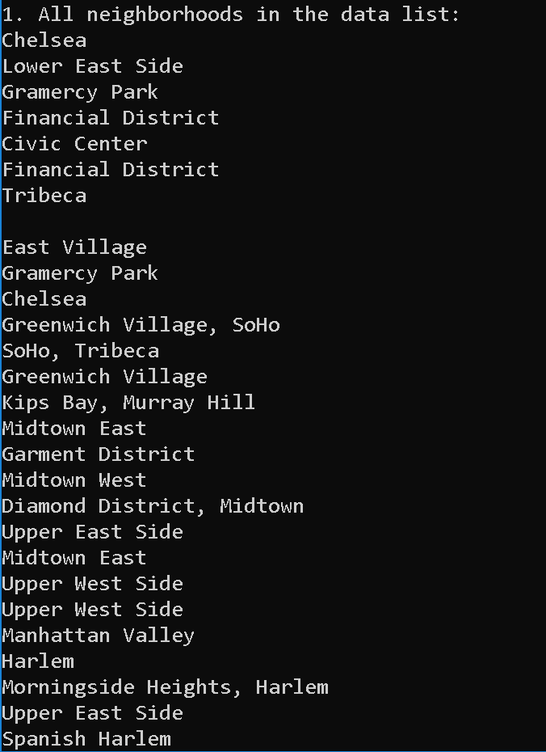
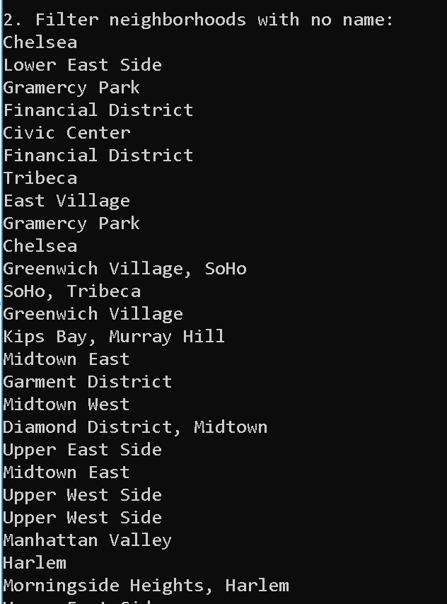
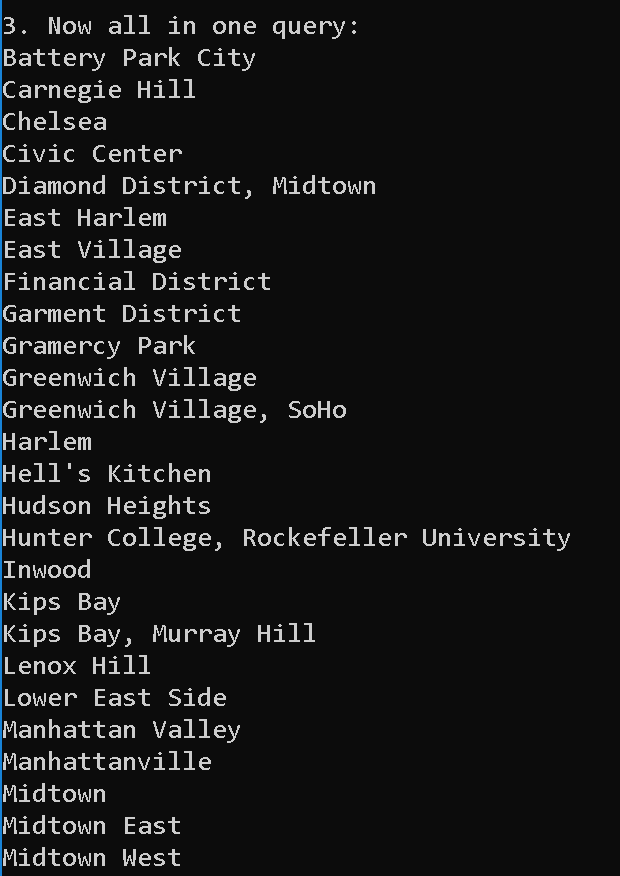
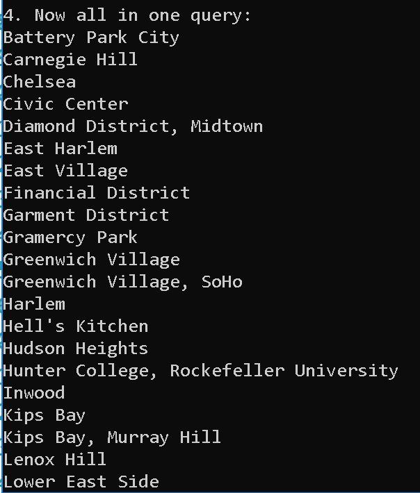
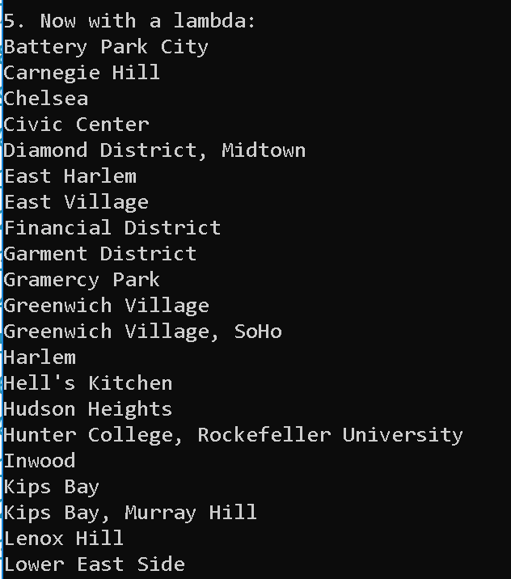

### Lab08 Manhattan

Provided a JSON file that contains a data set of location information for properties in Manhattan. Read in the file and answer the questions below using LINQ queries and Lambda statements.

- Output all of the neighborhoods in this data list
- Filter out all the neighborhoods that do not have any names
- Remove the Duplicates
- Rewrite the queries from above, and consolidate all into one single query.
- Rewrite at least one of these questions only using the opposing method (example: Use LINQ instead of a Lambda and vice versa.)

## Load Application

1. in terminal: git clone https://github.com/mtncrawler/lab08-manhattan.git
2. open lab08-manhattan.sln file
3. run without debugging
4. enjoy!